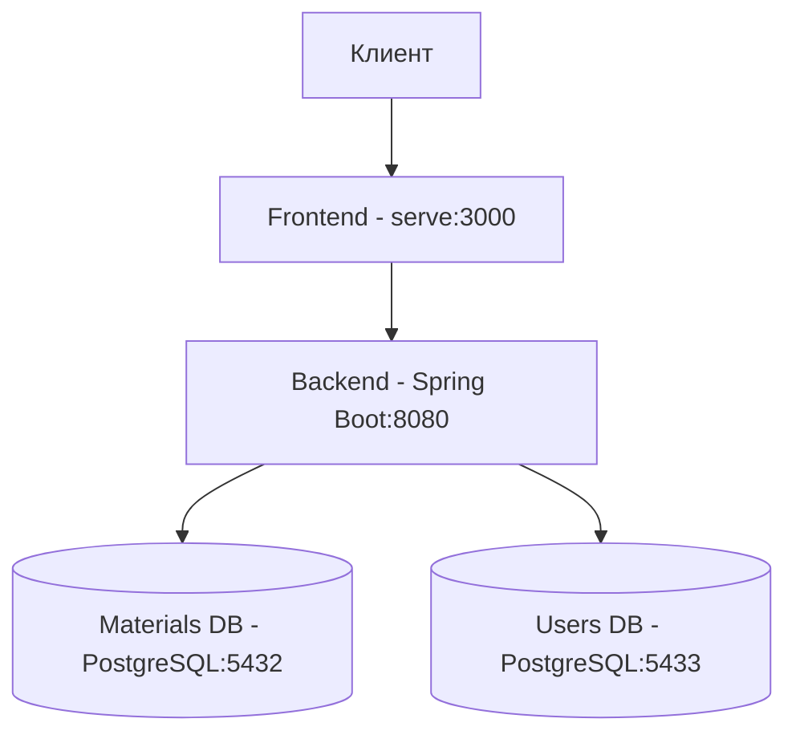
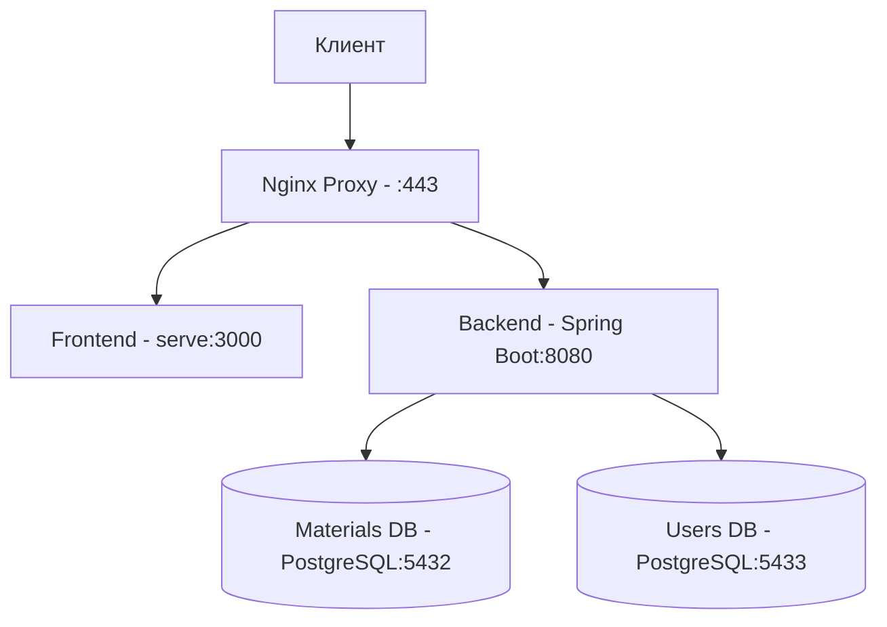

# Системные паттерны

## Архитектура приложения

### Текущая архитектура


### Планируемая архитектура с Nginx


## Паттерны проектирования

### Архитектурные паттерны
- **Микросервисная архитектура** - разделение на независимые сервисы
- **API Gateway** (планируется) - Nginx как единая точка входа
- **Reverse Proxy** (планируется) - Nginx для маршрутизации и безопасности
- **Load Balancing** (планируется) - распределение нагрузки через Nginx

### Паттерны безопасности
- **JWT Authentication** - для аутентификации пользователей
- **CORS Protection** - защита от несанкционированного доступа
- **SSL/TLS** (планируется) - шифрование трафика
- **Rate Limiting** (планируется) - защита от DDoS атак

### Паттерны данных
- **Repository Pattern** - для работы с базами данных
- **DTO Pattern** - для передачи данных между слоями
- **Data Mapper** - для маппинга данных между объектами

### Docker паттерны
- **Multi-stage builds** - для оптимизации образов
- **Health Check** - для мониторинга состояния сервисов
- **Volume Mounting** - для персистентности данных
- **Network Isolation** - для безопасности сервисов

## Принципы разработки

### Безопасность
- Все внешние соединения через HTTPS
- Валидация всех входных данных
- Принцип наименьших привилегий
- Регулярное обновление зависимостей

### Масштабируемость
- Горизонтальное масштабирование через Nginx
- Кэширование статического контента
- Оптимизация баз данных
- Балансировка нагрузки

### Мониторинг
- Логирование всех важных событий
- Мониторинг производительности
- Отслеживание ошибок
- Алертинг при проблемах

### DevOps
- Автоматизация развертывания
- Непрерывная интеграция
- Управление конфигурацией
- Резервное копирование данных

## Архитектура системы
- Микросервисная архитектура с разделением на фронтенд и бэкенд
- Использование Docker для контейнеризации
- Отдельные базы данных для материалов и пользователей
- NGINX как обратный прокси и для раздачи статики

## Паттерны безопасности
1. CORS (Cross-Origin Resource Sharing):
   - Централизованная валидация origins в NGINX
   - Использование переменных для безопасной обработки CORS
   - Поддержка множественных разрешенных доменов
   - Безопасная обработка preflight-запросов

2. JWT Authentication:
   - Токены для авторизации запросов
   - Безопасное хранение секретов
   - Валидация токенов на бэкенде

3. Безопасность баз данных:
   - Изоляция данных пользователей
   - Разделение прав доступа
   - Регулярное резервное копирование

## Паттерны развертывания
1. Docker Compose:
   - Многоконтейнерное развертывание
   - Управление зависимостями
   - Сетевая изоляция

2. NGINX Configuration:
   - Проксирование API-запросов
   - Обработка статических файлов
   - Управление CORS-заголовками
   - Кэширование статического контента

3. Database Management:
   - Отдельные контейнеры для баз данных
   - Персистентное хранение данных
   - Автоматическое резервное копирование

## Паттерны коммуникации
1. API Gateway:
   - Централизованная обработка запросов
   - Маршрутизация к микросервисам
   - Управление CORS и безопасностью

2. REST API:
   - Стандартные HTTP-методы
   - JSON для обмена данными
   - Версионирование API

3. Event Handling:
   - Асинхронная обработка запросов
   - Обработка ошибок
   - Логирование событий

## Паттерны мониторинга
1. Logging:
   - Структурированные логи
   - Отслеживание ошибок
   - Мониторинг безопасности

2. Health Checks:
   - Проверка состояния сервисов
   - Мониторинг баз данных
   - Отслеживание доступности API

3. Performance Monitoring:
   - Метрики производительности
   - Отслеживание времени отклика
   - Мониторинг использования ресурсов

# Архитектура системы и технические решения

## Общая архитектура
Проект NonIsothermicalFlow построен на основе микросервисной архитектуры с разделением на следующие основные компоненты:

1. **Фронтенд (React)**
   - SPA-приложение с компонентным подходом
   - Использование Material UI для унифицированного дизайна
   - Маршрутизация на основе React Router
   - Управление состоянием с помощью React Hooks
   - Взаимодействие с API через Axios

2. **Бэкенд (Spring Boot)**
   - REST API для взаимодействия с фронтендом
   - Многослойная архитектура (контроллеры, сервисы, репозитории)
   - Использование Spring Data JPA для работы с базами данных
   - Аутентификация и авторизация с использованием JWT
   - Валидация данных на уровне API

3. **Базы данных (PostgreSQL)**
   - База данных материалов (materials_db) для хранения данных о материалах и их свойствах
   - База данных пользователей (users_db) для хранения учетных записей и ролей

## Схема взаимодействия
```
+-----------------+       +------------------+       +------------------+
|                 |       |                  |       |                  |
|    Фронтенд     | <---> |     Бэкенд      | <---> |  Базы данных     |
|     (React)     |  HTTP |   (Spring Boot)  |  SQL  |   (PostgreSQL)   |
|                 |       |                  |       |                  |
+-----------------+       +------------------+       +------------------+
```

## Технические паттерны

### В бэкенде:
- **Repository Pattern** - абстракция слоя доступа к данным
- **Service Layer** - бизнес-логика, отделенная от контроллеров
- **DTO Pattern** - передача данных между слоями приложения
- **Dependency Injection** - внедрение зависимостей через Spring контейнер
- **Builder Pattern** - для создания сложных объектов

### В фронтенде:
- **Component-Based Architecture** - разделение UI на переиспользуемые компоненты
- **Container/Presentational Pattern** - разделение компонентов на компоненты с логикой и компоненты отображения
- **Hooks Pattern** - использование хуков React для управления состоянием
- **Routing Pattern** - навигация внутри SPA с React Router

## План докеризации
Для полной докеризации системы планируется следующая структура контейнеров:

```
+-------------------+       +------------------+       +------------------+
|                   |       |                  |       |                  |
|  Nginx контейнер  | <---> |  Spring Boot    | <---> |  PostgreSQL      |
|  (статика + прокси)|       |  контейнер      |       |  контейнеры      |
|                   |       |                  |       |                  |
+-------------------+       +------------------+       +------------------+
```

### Контейнеры:
1. **frontend-container**: Nginx с собранной статикой React приложения и проксированием API запросов
2. **backend-container**: Spring Boot приложение с JVM, оптимизированной для Docker
3. **postgres-materials-container**: PostgreSQL для хранения данных о материалах
4. **postgres-users-container**: PostgreSQL для хранения учетных данных пользователей

## Сетевое взаимодействие
- Все контейнеры будут находиться в одной Docker сети
- Nginx будет выступать в качестве обратного прокси для бэкенда
- Бэкенд будет взаимодействовать с базами данных по внутренним именам контейнеров
- Внешний доступ будет осуществляться только к контейнеру Nginx на портах 80/443 